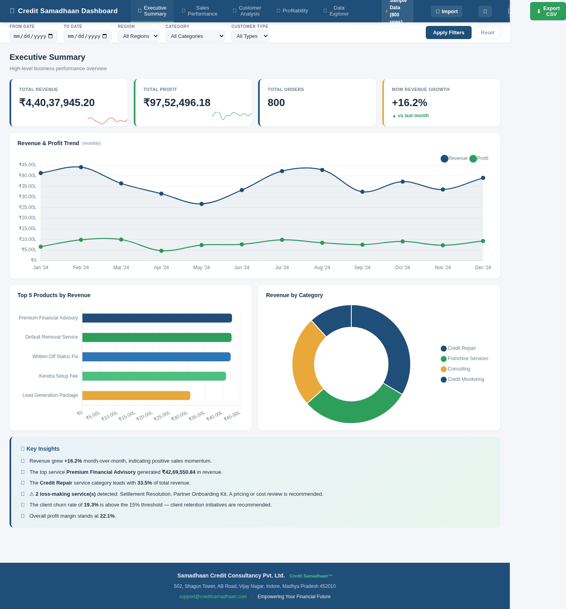
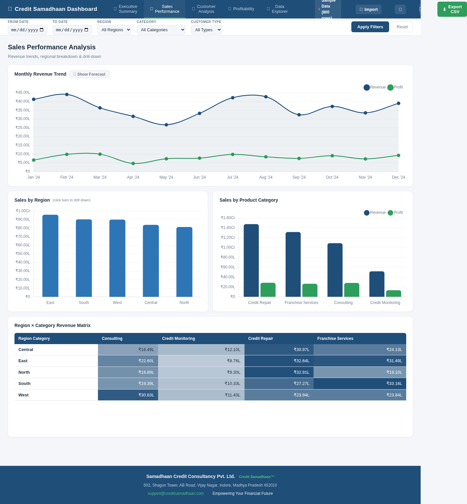
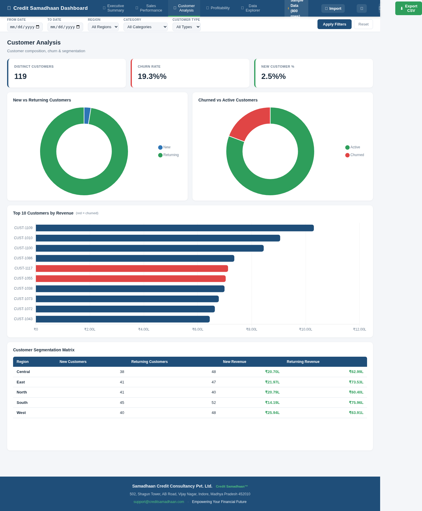
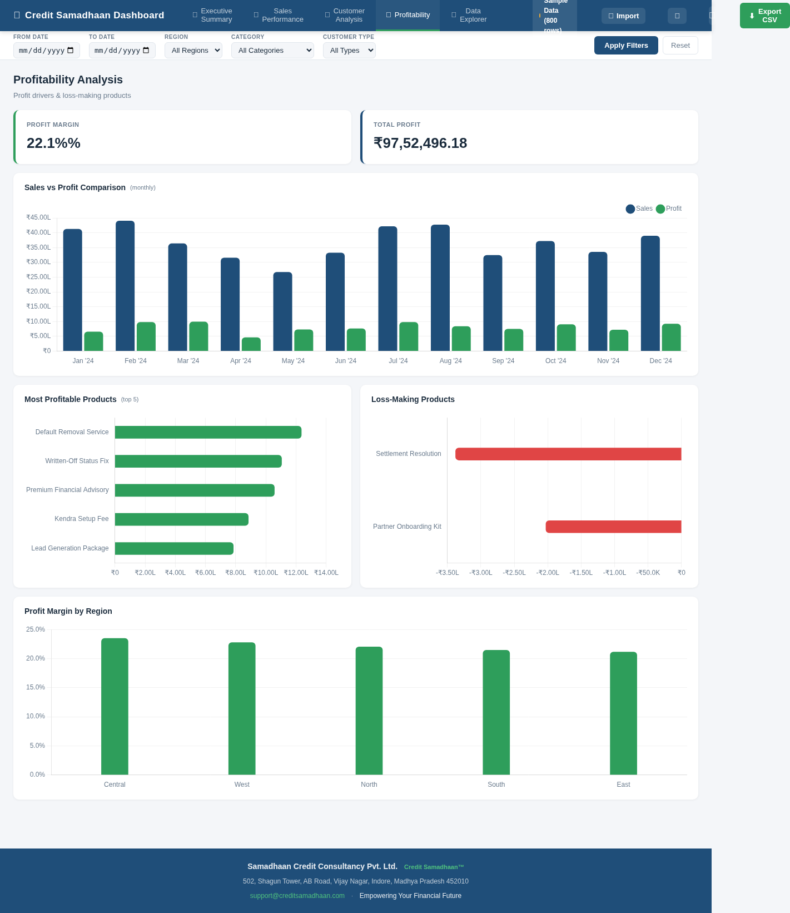
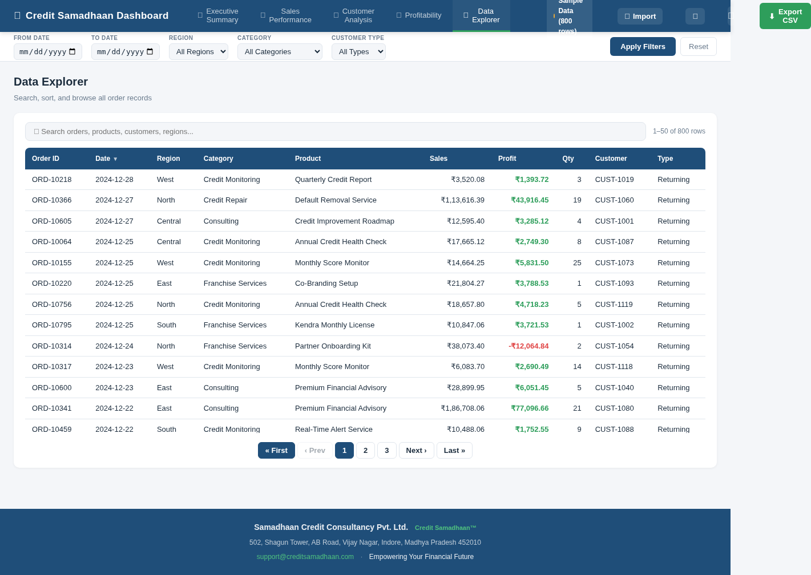
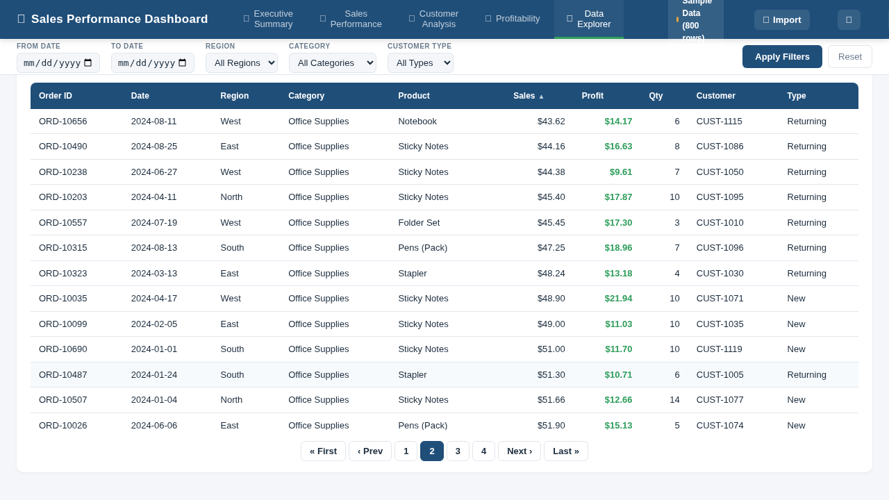
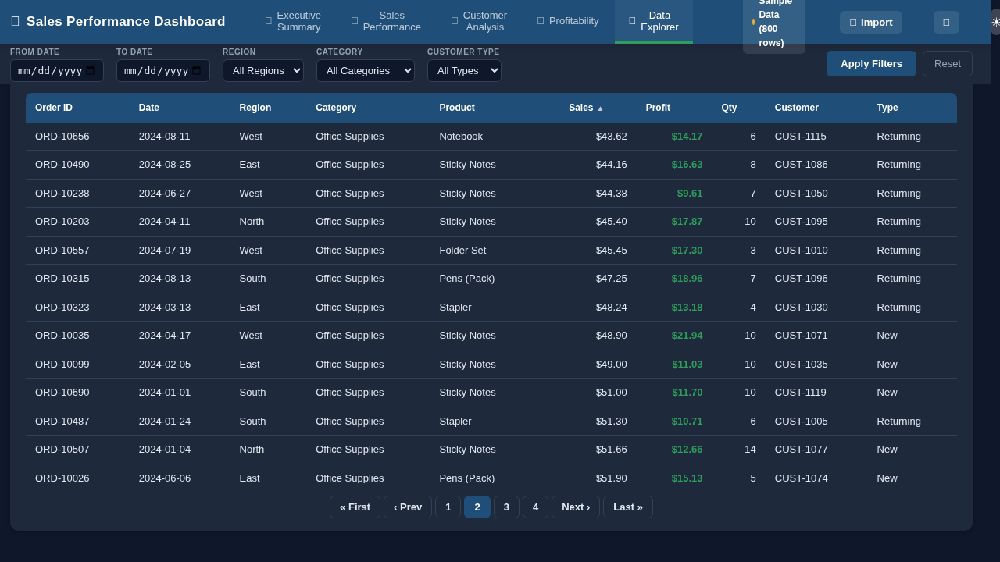

# 📊 Credit Samadhaan Dashboard

> **Empowering Your Financial Future**
>
*Samadhaan Credit Consultancy Pvt. Ltd.*

A production-grade, multi-page **Business Intelligence dashboard** built for visualizing sales performance, customer behavior, profitability, and order-level data — with interactive Chart.js visualizations, real-time filtering, CSV import/export, forecasting, and a realistic generated dataset of **800 orders**.

Built with **Node.js + Express** on the backend and **vanilla JavaScript + Chart.js** on the frontend. No build step required.

---

## 🖼️ Dashboard Preview

### Executive Summary
High-level KPIs, revenue & profit trends, top products, and AI-style business insights.



---

### Sales Performance
Monthly revenue trends, regional breakdown, category comparison, and an interactive region × category matrix.



---

### Customer Analysis
Customer churn tracking, new vs. returning breakdown, top customers by revenue, and regional segmentation.



---

### Profitability
Profit margin analysis, most profitable products, loss-making product detection, and regional margin comparison.



---

### Data Explorer
Searchable, sortable, paginated table of all 800 order records with one-click CSV export.



---

### 🌙 Dark Mode
A clean, eye-friendly dark theme — toggle with a single click.

| Light Mode | Dark Mode |
|------------|-----------|
|  |  |

---

## ✨ Features

| Feature | Description |
|---------|-------------|
| **5 Dashboard Pages** | Executive Summary, Sales Performance, Customer Analysis, Profitability, Data Explorer |
| **Interactive Charts** | Line, bar, and donut charts powered by Chart.js |
| **Real-Time Filtering** | Filter by date range, region, category, and customer type |
| **Forecasting** | Toggle sales/profit forecasts on the trend chart |
| **CSV Export** | Export filtered data to CSV with one click |
| **Data Explorer** | Search, sort, and paginate through all 800 orders |
| **Drill-Down** | Click chart bars (e.g. region) to drill into details |
| **Dark / Light Mode** | Full theme toggle for comfortable viewing |
| **Responsive Design** | Works across desktop, tablet, and mobile |
| **Indian Rupee (₹)** | All currency shown in ₹ (lakhs/crores) |

---

## 🛠️ Tech Stack

| Layer | Technology |
|-------|-----------|
| **Backend** | Node.js, Express |
| **Frontend** | Vanilla JavaScript, HTML5, CSS3 |
| **Charts** | Chart.js |
| **Data** | In-memory generated dataset (800 realistic orders) |
| **Testing** | Node.js built-in test runner |

---

## 📁 Project Structure

```
sales-performance-dashboard/
├── server.js                 # Express server entry point
├── src/
│   ├── routes/api.js         # API route handlers
│   ├── analytics/metrics.js  # Analytics & KPI computation engine
│   └── data/generator.js     # Dataset generator (800 orders)
├── public/
│   ├── index.html            # Main dashboard UI
│   ├── css/dashboard.css     # Dashboard styling (light + dark)
│   └── js/
│       ├── app.js            # Frontend app logic & navigation
│       ├── charts.js         # Chart.js chart definitions
│       └── api.js            # Frontend API client
├── test/                     # Unit & integration tests
├── docs/screenshots/         # Dashboard screenshots
└── package.json
```

---

## 🚀 Getting Started

### Prerequisites

- [Node.js](https://nodejs.org/) v18+ installed

### Installation

```bash
# Clone the repository
git clone https://github.com/rsr605/sales-performance-dashboard.git
cd sales-performance-dashboard

# Install dependencies
npm install

# Start the server
npm start
```

The dashboard will be available at **http://localhost:3000**.

---

## 🧪 Testing

```bash
npm test
```

Runs the full test suite using Node.js's built-in test runner.

---

## 📈 KPIs & Metrics Tracked

- **Total Revenue** — with month-over-month growth
- **Total Profit** — and overall profit margin %
- **Total Orders** — order volume
- **Customer Churn Rate** — with retention insights
- **New vs. Returning Customers** — acquisition vs. retention split
- **Top Products by Revenue** — best-selling services
- **Most Profitable / Loss-Making Products** — margin optimization
- **Revenue by Region & Category** — geographic & segment breakdown

---

## 🏢 About

**Samadhaan Credit Consultancy Pvt. Ltd.**
502, Shagun Tower, AB Road, Vijay Nagar, Indore, Madhya Pradesh 452010
✉️ support@creditsamadhaan.com

*Credit Samadhaan™ — Empowering Your Financial Future*

---

## 📄 License

This project is proprietary. © Samadhaan Credit Consultancy Pvt. Ltd.
